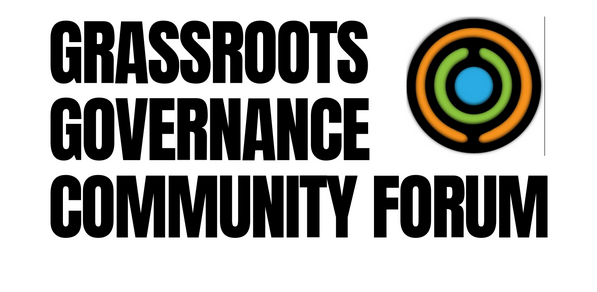

# Governance Guild


[about-us.md](about-us.md)



[our-team.md](our-team.md)


<figure><figcaption></figcaption></figure>


[what-are-the-grassroots-governance-forums.md](grassroots-governance-community-forums/what-are-the-grassroots-governance-forums.md)



[introduction.md](project-based-learning/introduction.md)

