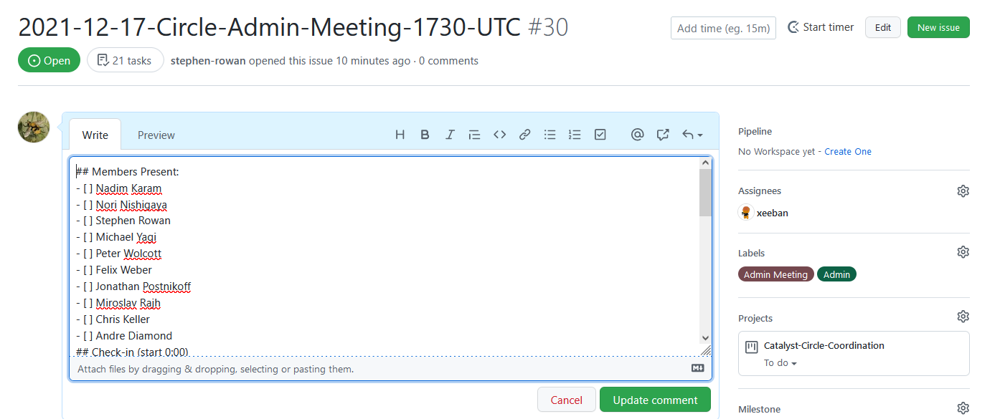
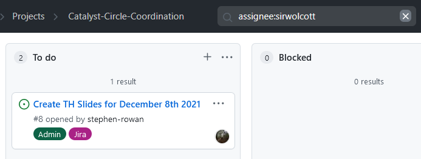

# Admin Meetings

IN DRAFT

## Meeting Issues

Admin meetings are recorded as GitHub Issues an example of this can be seen [here](https://github.com/Catalyst-Circle/Catalyst-Circle-Coordination/issues/4).

### Admin Meeting Issue Template

To raise an Admin Meeting Issue please use the template provided [here ](https://github.com/Catalyst-Circle/Catalyst-Circle-Coordination/issues/new/choose)

### Recording progress using the Admin Issue

Please use the Meeting Issue (not Google docs) to record progress and integrate with Project Board standups. This is what ties everything together. Click on the the three dots on the top right of the Issue to edit the markdown during the Admin meeting.

## Stand ups

### Overview

An admin meeting standup goes round each member and asks -

What have you done ?

What are you planning to do ?&#x20;

What blocking you ?

### Filtering Issue Cards

On the _Catalyst-Circle-Coordination Project Board_ ([link](https://github.com/Catalyst-Circle/Catalyst-Circle-Coordination/projects/1)) filter the issue cards by clicking on 1) the Admin label and 2) the assignee picture icon (to filter an individual).

Filters can be cleared by clicking the cross inside the _Filter Cards_ dialog box at the top of the screen. For more detail on filtering GitHub Project Boards see [here](https://docs.github.com/en/issues/organizing-your-work-with-project-boards/tracking-work-with-project-boards/filtering-cards-on-a-project-board).

